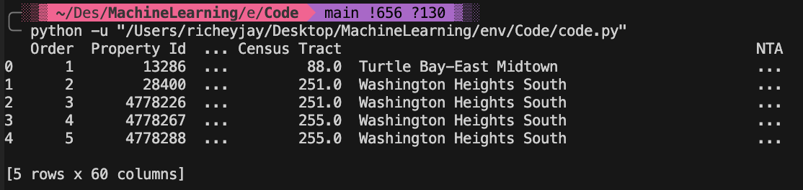

# Machine Learning Project using Python 

## General machine learning workflow step-by-step
   - Data cleaning and formatting
   - Exploratory data analysis
   - Feature engineering and selection
   - Compare several machine learning models on a performance metric
   - Perform hyper-parameter tuning on the best model
   - Evaluate the best model on the testing set
   - Interpret the model results
   - Draw conclusions and document work

# Problem Definition
   In this project, we will work with publicly available building energy data from New York City.
   The objective is to use the energy data to build a model that can predict the Energy Star Score of a building and interpret the results to find the factors which influence the score.
   The data includes the `Energy Star Score`, which makes this a supervised regression machine learning task:
   - `Supervised:` we have access to both the features and the target and our goal is to train a model that can learn a mapping between the two.
   - `Regression:` The Energy Star score is a continuous variable
   
   We want to develop a model that is both `accurate` — it can predict the Energy Star Score close to the true value — and `interpretable` — we can understand the model predictions. Once we know the goal, we can use it to guide our decisions as we dig into the data and build models.
# Data Cleaning
Top of our data
Load in the data as a Pandas DataFrame
```python
import pandas as pd
import numpy as np
# Read in data into a dataframe 
data = pd.read_csv('/Users/richeyjay/Desktop/MachineLearning/env/Code/Energy_and_Water_Data_Disclosure_for_Local_Law_84_2017__Data_for_Calendar_Year_2016_.csv')
# Display top of dataframe
print(data.head())
```



