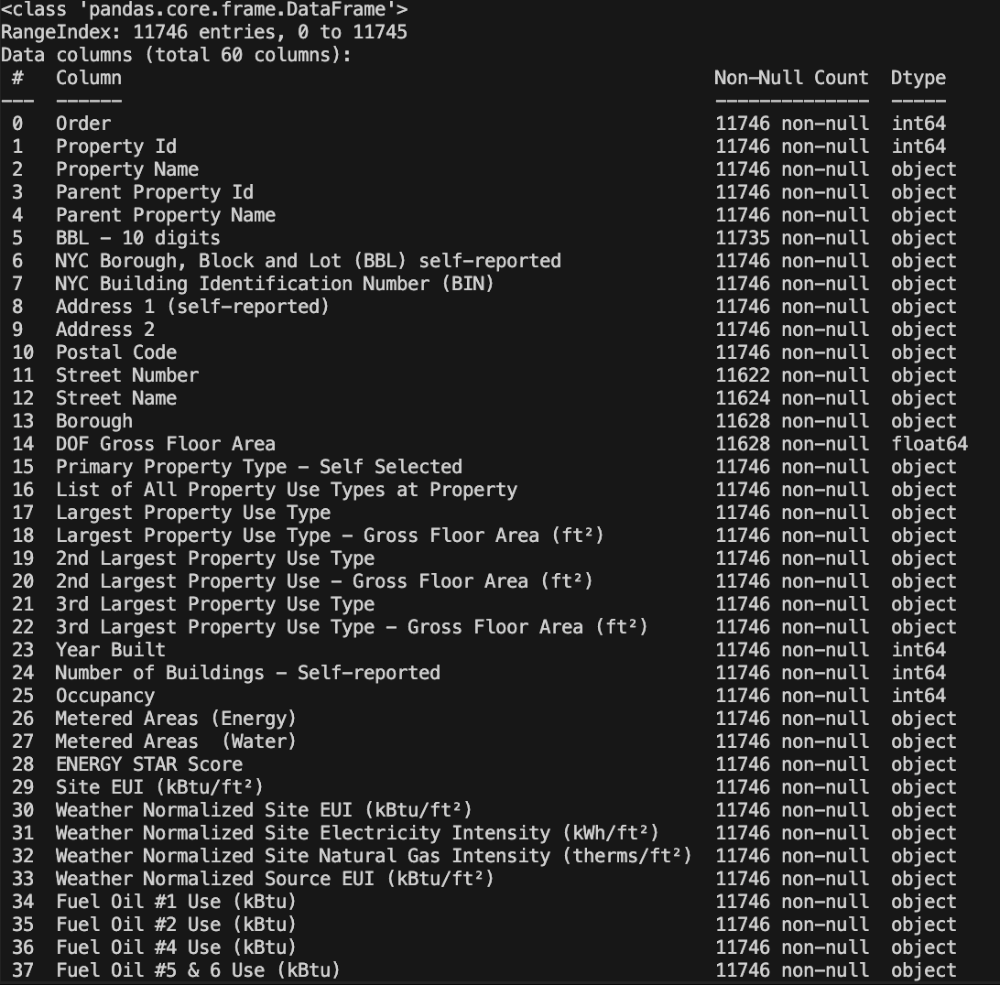
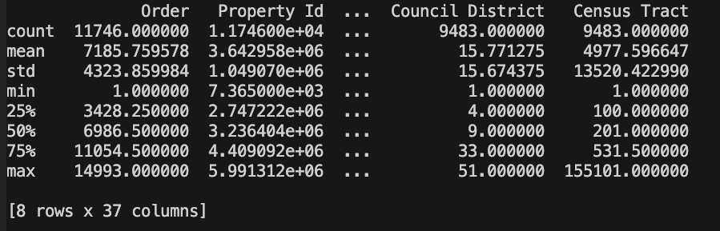

# Machine Learning Project using Python 

## General machine learning workflow step-by-step
   - Data cleaning and formatting
   - Exploratory data analysis
   - Feature engineering and selection
   - Compare several machine learning models on a performance metric
   - Perform hyper-parameter tuning on the best model
   - Evaluate the best model on the testing set
   - Interpret the model results
   - Draw conclusions and document work

# Problem Definition
   In this project, we will work with publicly available building energy data from New York City.
   The objective is to use the energy data to build a model that can predict the Energy Star Score of a building and interpret the results to find the factors which influence the score.
   The data includes the `Energy Star Score`, which makes this a supervised regression machine learning task:
   - `Supervised:` we have access to both the features and the target and our goal is to train a model that can learn a mapping between the two.
   - `Regression:` The Energy Star score is a continuous variable
   
   We want to develop a model that is both `accurate` — it can predict the Energy Star Score close to the true value — and `interpretable` — we can understand the model predictions. Once we know the goal, we can use it to guide our decisions as we dig into the data and build models.
# Data Cleaning
Top of our data, Loading in the data as a Pandas DataFrame
```python
import pandas as pd
import numpy as np
# Read in data into a dataframe 
data = pd.read_csv('/Users/richeyjay/Desktop/MachineLearning/env/Code/Energy_and_Water_Data_Disclosure_for_Local_Law_84_2017__Data_for_Calendar_Year_2016_.csv')
# Display top of dataframe
print(data.head())
```

If we observe our subset of data that contains 60 columns we can already see some issues.
First, we know that we want to predict the `ENERGY STAR` score but we don’t know what any of the columns mean.
We want to focus on `interpretability`, so its important to understand at least some of the columns.


After some digging on the web pertaining to the file name "Local Law 84" [Local Law 84](https://www.nyc.gov/site/buildings/codes/compliance-instructions.page) I found an NYC law requiring all buildings of a certain size to report their energy use.
Some more searching I found the definitions of the columns. [Definitions of Columns](https://www.nyc.gov/html/gbee/downloads/misc/nyc_benchmarking_disclosure_data_definitions_2017.pdf)

`Energy Star Score` is defined as 'A 1-to-100 percentile ranking based on self-reported energy usage for the reporting year. The Energy Star score is a relative measure used for comparing the energy efficiency of buildings.'

   ## Handling "Not Available" missing values
This is a string in Python which means that even the columns with numbers will be stored as object datatypes because Pandas converts a column with any strings into a column of all strings. We can see the datatypes of the columns using the dataframe.info() method:
```python
# See the column data types and non-missing values
print(data.info())
```

If we observe some of the columns in the data we can see that some contain numerical metric units such as
ft², kBtu, kWh etc, but we see that they are stored as objects. Since we cant do numerical analysis on strings
they will have to be converted to number (specifically float) data types
## Converting Data to correct types
We convert the columns with numbers into numeric data types by replacing the "Not Available" entries with np.nan which can be interpreted as floats. Then we will convert the columns that contain numeric values (such as square feet or energy usage) into numeric datatypes.

```python
# Replace all occurrences of Not Available with numpy not a number
data = data.replace({'Not Available': np.nan})

# Iterate through the columns
for col in list(data.columns):
    # Select columns that should be numeric
    if ('ft²' in col or 'kBtu' in col or 'Metric Tons CO2e' in col or 'kWh' in 
        col or 'therms' in col or 'gal' in col or 'Score' in col):
        # Convert the data type to float
        data[col] = data[col].astype(float)
```
```python
data.describe()
```



## Handling Missing Values in dataset 
We want to start analyzing our data by looking at the percentage of missing values in each column. 
Missing values are fine when we do `Exploratory Data Analysis`, but they will have to be filled in for machine learning methods.